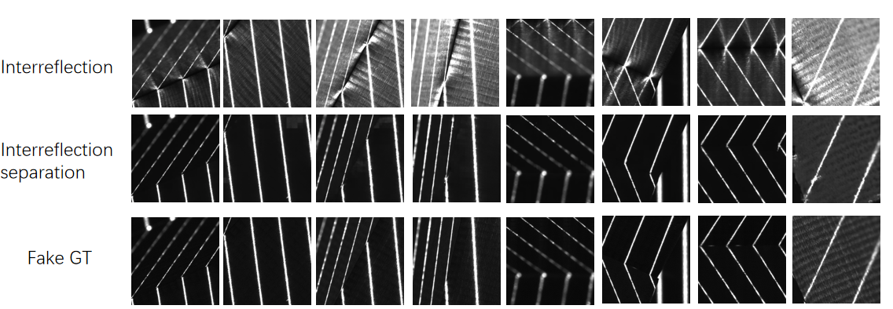

## RRNet: Temporal Line-Shifting 3D Reconstruction Based on Swin Transformer under Strong Interreflection Conditions

#### Yu-Fei Liu

---

Abstract: With the growing demand for 3D reconstruction technology in industrial automation, traditional methods face numerous challenges when handling non-Lambertian surfaces. Digital fringe projection profilometry suffers from reduced accuracy and significant point cloud missing when reconstructing smooth surfaces with concave structures, primarily due to interreflections between surfaces. To address this issue, this paper proposes a deep learning approach based on the Swin Transformer architecture, aiming to effectively suppress interreflection interference at the image level and achieve high-fidelity 3D reconstruction by combining temporal phase-shifting fringe projection. Specifically, we design a Mutual Reflection Removal Network (RRNet) that takes fringe images corrupted by interreflections as input, learns to suppress these interreflections, and recovers clean images close to ideal Lambertian reflection. Subsequently, 3D surface reconstruction is performed using the denoised image sequences. Experimental results demonstrate that the proposed method significantly improves point cloud density and geometric accuracy under complex industrial scenarios involving high reflectivity, strong interreflections, and high dynamic illumination. It effectively alleviates data missing issues caused by optical interference in traditional methods. Extensive experiments verify that, in challenging environments with high reflectivity and interreflections, the proposed method outperforms conventional approaches in terms of accuracy and point cloud completeness, enabling high-precision and efficient 3D reconstruction, particularly suitable for applications in industrial automation inspection.

---

